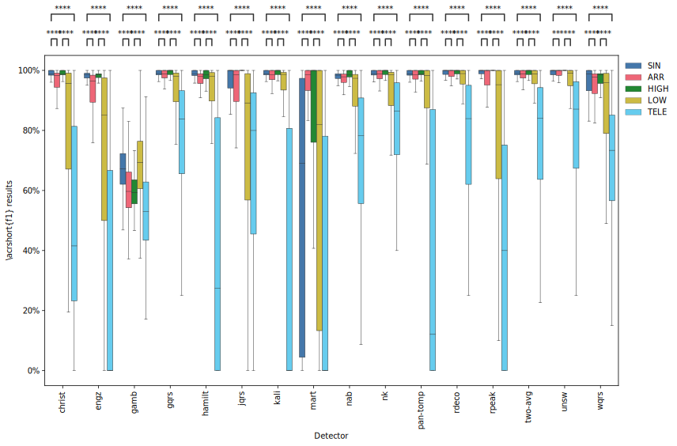
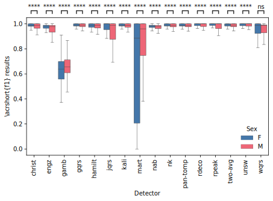
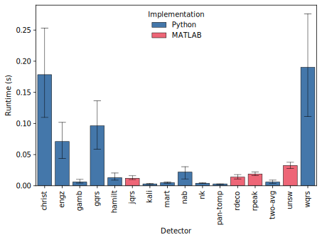
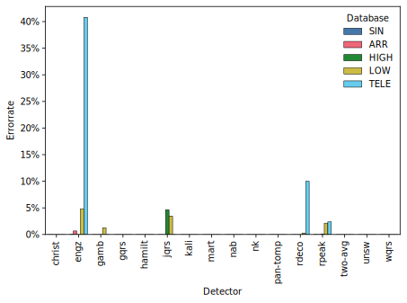
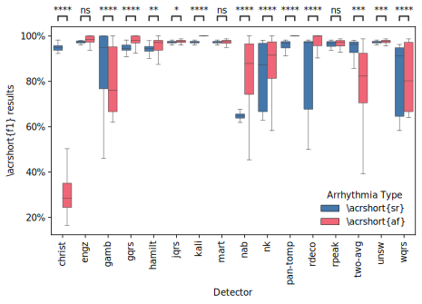
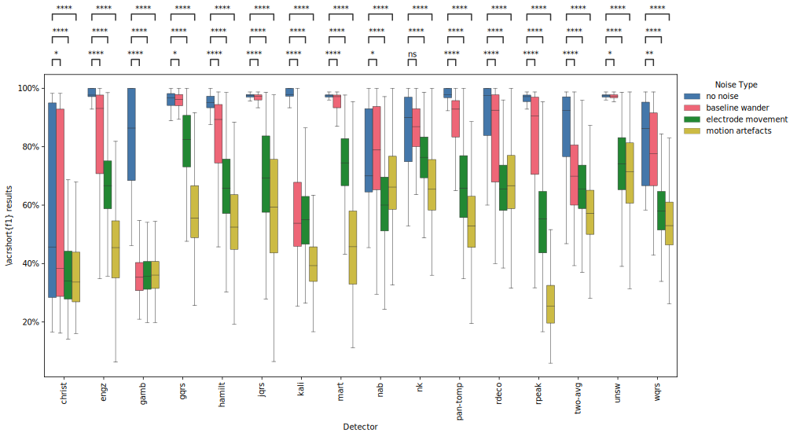
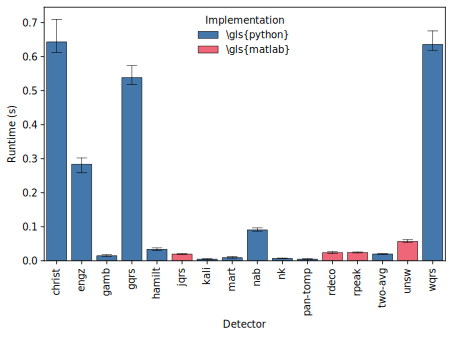
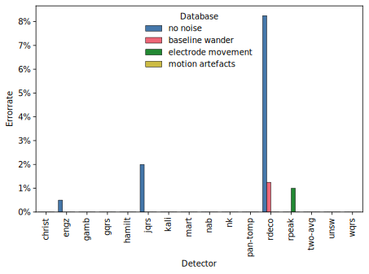

# Assessment of Electrocardiogram Beat Detectors Using Synthetic and Real-World Data
This repository contains three main resources. **Algorithm_tester** contains databases, algorithms and a script to test them. **Annotator** has a MATLAB script that allows annotation of WFDB ECG signals. **Signal_generator** contains MATLAB scripts that can generate synthetic ECG signals.

This code has been created and tested with **Visual Studio Code 1.73.0**, **MATLAB R2022a**, and **Python 3.9**. The versions of other libraries used can be found in `requirements.txt`.

## Authors
- Florian Kristof [floriankri](https://github.com/floriankri)
- Peter Charlton [peterhcharlton](https://github.com/peterhcharlton)
- Leon Nissen
- Maximilian Kapsecker

## Citation/DOI

## Installation
### Algorithm Tester
1. Install **Visual Studio Code**
2. Install **Python 3.9**
3. Install **MATLAB R2022a** or higher
4. Install **MATLAB Engine API for Python** available [here](https://www.mathworks.com/help/matlab/matlab_external/install-the-matlab-engine-for-python.html) in Visual Studio Code
5. `pip install requirements.txt` in Visual Studio Code
6. Try executing `/Algorithm_tester/main.ipynb` and see if and where it runs into errors

### Annotator
1. Install **MATLAB R2022a** or higher
2. Install **Waveform Database Software Package (WFDB) for MATLAB and Octave** available [here](https://physionet.org/content/wfdb-matlab/0.10.0/)
3. Change all permanent paths in the files to your local paths
4. Change paths to signals that should be used in `/Annotator/MAIN.m`

### Signal Generator
This part is automatically executed by **Algorithm Tester**. If you want to setup the unchanged version please visit the initial page called [Model for Simulating ECG and PPG Signals with Arrhythmia Episodes](https://physionet.org/content/ecg-ppg-simulator-arrhythmia/1.3.1/).

## Usage and Results
### Algorithm Tester
After Installation as described above the notebook should run through in one go. All variables that might be necessary to change can be found in the **Control Variables** part of the Notebook. To evluate databases change the respective value in the Control Variables to `True` for one run. After successful evaluation change the respective Control Variable back to `False` as each evaluation takes quite some time.

#### Real Data
##### **Database Comparison**

##### **Influence of Sex**

##### **Runtime Investigation**

##### **Error Investigation**

#### Synthetic Data
##### **Comparing Atrial Fibrillation and Sinus Rhythm**

##### **Noise Type Comparison**

##### **Runtime Investigation**

##### **Error Investigation**

### Annotator
After changing the path to the respective folder that you want to read the signals from you can run `/Annotator/MAIN.m` and follow the instructions in the terminal. After you have annotated some signals you can review them using the review function by again following the instructions in the terminal.

### Signal Generator
As described above this code is used in the `/Algorithm_tester/main.ipynb` Notebook and is an adapted version of [Model for Simulating ECG and PPG Signals with Arrhythmia Episodes](https://physionet.org/content/ecg-ppg-simulator-arrhythmia/1.3.1/). Please refer to the original version for usage instructions.